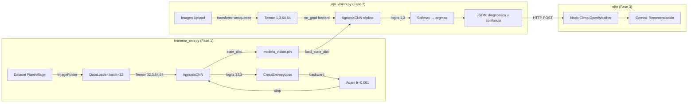

# Guía de Estudio Progresiva — Orquestador Agrícola Neural

> Material organizado de **menos a más técnico**. Si tienes poco tiempo, estudia en orden y detente donde te sientas cómodo. Cada nivel es suficiente para el anterior.

---

## Índice por Nivel

- 🟢 [Nivel 1 — ¿Qué hace este proyecto? (5 min)](#-nivel-1--qué-hace-este-proyecto)
- 🟡 [Nivel 2 — ¿Cómo está construido? (10 min)](#-nivel-2--cómo-está-construido)
- 🟠 [Nivel 3 — ¿Cómo aprende la red? (15 min)](#-nivel-3--cómo-aprende-la-red)
- 🔴 [Nivel 4 — Detalles técnicos profundos (20 min)](#-nivel-4--detalles-técnicos-profundos)
- ⚫ [Nivel 5 — Auditoría completa de hiperparámetros (referencia)](#-nivel-5--auditoría-completa-de-hiperparámetros)

---

## 🟢 Nivel 1 — ¿Qué hace este proyecto?

**Objetivo:** Entender el sistema sin conocer nada de programación ni redes neuronales.

### El problema que resuelve

Un agricultor tiene una planta enferma. Toma una foto con el celular. El sistema le dice en segundos qué enfermedad tiene y qué tratamiento aplicar.

### Los tres pasos del sistema

```
📷 Foto de la hoja
       │
       ▼
🧠 Red Neuronal (CNN) — analiza la imagen como un experto visual
       │ "Es Oídio, confianza 92%"
       ▼
🌤️ API del Clima — consulta temperatura y humedad de la zona
       │
       ▼
🤖 Gemini (IA de Google) — cruza diagnóstico + clima y recomienda tratamiento
       │
       ▼
💬 Respuesta al agricultor vía formulario web o Telegram
```

### Las tres enfermedades que detecta

| Clase | Qué es | Síntoma visual |
|---|---|---|
| `Planta_Sana` | Sin enfermedad | Verde uniforme |
| `Tizon_Tardio_Papa` | Hongo que destruye papas | Manchas marrones oscuras |
| `Oidio_Vid` | Hongo que afecta uvas | Polvo blanco en la hoja |

### Los dos archivos de código

| Archivo | Qué hace en una frase |
|---|---|
| `entrenar_cnn.py` | Enseña a la red neuronal a distinguir las 3 enfermedades usando miles de fotos |
| `api_vision.py` | Expone la red entrenada como un servicio web que recibe fotos y responde diagnósticos |

---

## 🟡 Nivel 2 — ¿Cómo está construido?

**Objetivo:** Entender la arquitectura sin saber matemáticas.

### ¿Qué es una Red Neuronal Convolucional (CNN)?

Imagina que tienes una foto de una hoja y la analizas con una lupa que se mueve por toda la imagen buscando patrones:

- **Primera pasada con la lupa:** detecta cosas simples — bordes, cambios de color, zonas brillantes
- **Segunda pasada:** combina esos patrones simples y detecta cosas más complejas — manchas, texturas, distribución de colores
- **Al final:** con toda esa información, decide a cuál de las 3 clases pertenece la hoja

Eso es exactamente lo que hace la CNN. La "lupa" se llama **filtro** o **kernel**.

### La arquitectura de AgricolaCNN en lenguaje simple

```
FOTO (64×64 píxeles, 3 colores RGB)
    │
    ▼ Bloque 1: 16 "lupas" buscan patrones simples
    │   → La imagen se achica a la mitad (64→32)
    │
    ▼ Bloque 2: 32 "lupas" buscan patrones complejos
    │   → La imagen se achica a la mitad (32→16)
    │
    ▼ Aplanado: convierte la imagen en una lista de 8192 números
    │
    ▼ Clasificador: 8192 números → 64 → 3 scores finales
    │
    ▼ El score más alto gana → "Oidio_Vid con 92% de confianza"
```

### ¿Qué son los archivos `.pth`?

`modelo_vision.pth` guarda la "memoria" de la red: todos los valores que aprendió durante el entrenamiento. Es como guardar el estado de un cerebro entrenado. Sin ese archivo, la red no sabe distinguir nada.

### Flujo entre los dos archivos

```
entrenar_cnn.py                    api_vision.py
──────────────                     ─────────────
1. Toma miles de fotos    ──────►  1. Carga la red entrenada
2. Entrena la red                  2. Recibe una foto nueva
3. Guarda modelo_vision.pth        3. Devuelve el diagnóstico
```

---

## 🟠 Nivel 3 — ¿Cómo aprende la red?

**Objetivo:** Entender el ciclo de entrenamiento y por qué funciona.

### La analogía del estudiante con examen

El entrenamiento funciona exactamente como estudiar para un examen con respuestas:

1. **La red ve una foto** → hace una predicción (al azar al principio)
2. **Se compara con la respuesta correcta** → se calcula el error (loss)
3. **Se analiza dónde se equivocó** → backpropagation encuentra qué parámetros fallaron
4. **Se corrigen los parámetros** → el optimizador ajusta los pesos un poco
5. **Repetir 630 veces** → la red mejora progresivamente

### Las épocas y los batches

- **Época:** una pasada completa por todas las fotos del dataset (~2000 imágenes)
- **Batch:** en vez de actualizar la red después de cada foto, agrupa 32 fotos, calcula el error promedio y actualiza una sola vez. Es más eficiente.
- Con 2000 imágenes y batch=32: cada época tiene ~63 actualizaciones. Con 10 épocas: **630 actualizaciones totales**.

```
ÉPOCA 1 ──────────────────────────────────────────────────────────
  Batch 1 (fotos 1-32):   forward → loss=2.1 → backward → update
  Batch 2 (fotos 33-64):  forward → loss=1.9 → backward → update
  ...
  Batch 63 (fotos 1969-2000): forward → loss=1.4 → backward → update
  Loss promedio época 1: 1.8

ÉPOCA 2 ──────────────────────────────────────────────────────────
  Batch 1 (fotos mezcladas): forward → loss=1.2 → backward → update
  ...
  Loss promedio época 2: 1.1

...continúa hasta ÉPOCA 10...
  Loss promedio época 10: 0.3  ← la red ya aprendió
```

### ¿Qué es la función de pérdida (CrossEntropyLoss)?

Es el "puntaje de equivocación". Cuando la red dice "Planta_Sana con 95%" pero la foto era Tizón, el loss es muy alto. Cuando acerta con alta confianza, el loss es casi 0.

La fórmula simplificada: `loss = -log(probabilidad_asignada_a_la_clase_correcta)`

| Predicción | Probabilidad clase correcta | Loss |
|---|---|---|
| Muy seguro y correcto | 0.95 | 0.05 (bajo) |
| Inseguro | 0.50 | 0.69 (medio) |
| Muy seguro pero incorrecto | 0.05 | 3.0 (alto) |

### ¿Cómo funciona la inferencia (api_vision.py)?

En producción **NO hay entrenamiento**. La red solo hace el paso hacia adelante:

```python
with torch.no_grad():      # "No necesito calcular gradientes"
    outputs = model(foto)  # Un solo forward pass
    probs = softmax(outputs)  # Convierte scores en probabilidades
    clase = argmax(probs)     # La más probable gana
```

---

## 🔴 Nivel 4 — Detalles técnicos profundos

**Objetivo:** Entender las decisiones de diseño y sus fundamentos matemáticos.

### ¿Por qué ReLU y no Sigmoid como activación?

**Vanishing Gradient:** En redes profundas, los gradientes se multiplican por la derivada de la activación en cada capa hacia atrás.

- `Sigmoid'(x) ≤ 0.25` → después de 3 capas: `0.25³ = 0.016` → gradientes casi nulos
- `ReLU'(x) = 1` (para x > 0) → gradientes sin reducción → la red aprende en todas las capas

**En este proyecto:** sin ReLU, `conv1` (la primera capa) recibiría gradientes ≈0 y nunca aprendería a detectar bordes.

### ¿Por qué Adam y no SGD?

SGD actualiza todos los parámetros con el mismo learning rate:
`w = w - lr × gradiente`

Adam adapta el lr **por parámetro** según su historia de gradientes:
`w = w - lr × m̂ / (√v̂ + ε)`

- `m̂`: promedio móvil del gradiente (momentum, β₁=0.9)
- `v̂`: promedio móvil del gradiente² (escala, β₂=0.999)

**Resultado práctico:** Con solo 630 actualizaciones disponibles, Adam converge donde SGD aún está "calentando".

### ¿Por qué CrossEntropyLoss y no MSE?

MSE mide `(predicción - valor_real)²`. Para clasificación el "valor real" es una etiqueta (0, 1 o 2), no un número continuo. Si la red predice `[0.1, 0.8, 0.1]` para la clase 1, MSE la trataría como casi correcta. CrossEntropyLoss penaliza correctamente basándose en probabilidades.

### El bug de CLASS_NAMES (caso de estudio real)

`ImageFolder` asigna etiquetas en orden **alfabético** de los subdirectorios:
```
data/Oidio_Vid/         → índice 0
data/Planta_Sana/       → índice 1
data/Tizon_Tardio_Papa/ → índice 2
```

En `entrenar_cnn.py`, `CLASSES = ["Planta_Sana", "Tizon_Tardio_Papa", "Oidio_Vid"]` es solo para generar el mock dataset, no define las etiquetas del entrenamiento real.

En `api_vision.py`, si `CLASS_NAMES = ["Planta_Sana", "Tizon_Tardio_Papa", "Oidio_Vid"]` (orden incorrecto), cuando la red predice índice 0 (Oidio), el código retornaría "Planta_Sana". **El modelo funcionaría perfectamente pero las etiquetas estarían cruzadas.** Corregido en Sesión 2 usando orden alfabético.

### Flujo completo del tensor con shapes

```
Foto JPG en disco
       │
       ▼ PIL.Image.open() + convert("RGB")
PIL [H, W, 3]   ← tamaño original (ej: 1200×900×3)
       │
       ▼ transforms.Resize((64, 64))
PIL [64, 64, 3]
       │
       ▼ transforms.ToTensor()   ← reordena dimensiones y normaliza
Tensor [3, 64, 64]   float32, rango [0.0, 1.0]
       │
       ▼ transforms.Normalize((0.5,0.5,0.5),(0.5,0.5,0.5))
Tensor [3, 64, 64]   float32, rango [-1.0, 1.0]
       │
       ▼ DataLoader: agrupa 32 imágenes
Tensor [32, 3, 64, 64]
       │
       ▼ conv1: 16 filtros 3×3, padding=1  →  (64+2-3)/1+1=64
Tensor [32, 16, 64, 64]
       │
       ▼ relu1: max(0, x)
Tensor [32, 16, 64, 64]
       │
       ▼ pool1: MaxPool2d(2,2)  →  64/2=32
Tensor [32, 16, 32, 32]
       │
       ▼ conv2: 32 filtros 3×3, padding=1
Tensor [32, 32, 32, 32]
       │
       ▼ relu2
Tensor [32, 32, 32, 32]
       │
       ▼ pool2: MaxPool2d(2,2)  →  32/2=16
Tensor [32, 32, 16, 16]
       │
       ▼ x.view(32, -1)  →  32×16×16 = 8192
Tensor [32, 8192]
       │
       ▼ fc1: Linear(8192, 64)
Tensor [32, 64]
       │
       ▼ relu3
Tensor [32, 64]
       │
       ▼ fc2: Linear(64, 3)
Tensor [32, 3]   ← 3 logits por imagen (scores crudos)
       │
       ▼ CrossEntropyLoss(outputs, labels)
Tensor []        ← escalar: loss promedio del batch
```

---

## ⚫ Nivel 5 — Auditoría Completa de Hiperparámetros

**Referencia técnica exhaustiva.** Usa esto para responder preguntas específicas.

### Hiperparámetros de Entrenamiento

| Parámetro | Valor | Archivo | Justificación |
|---|---|---|---|
| `IMG_SIZE` | `64` | `entrenar_cnn.py:27` | 64×64 = compromiso CPU/resolución. 224 requiere GPU. |
| `BATCH_SIZE` | `32` | `entrenar_cnn.py:28` | Estándar empírico. Menor=ruidoso, mayor=memoria. |
| `EPOCHS` | `10` | `entrenar_cnn.py:29` | ~630 actualizaciones. Conservador anti-overfitting. |
| `lr` | `0.001` | `entrenar_cnn.py:108` | Default Adam. Recomendado por Kingma & Ba (2014). |
| `Normalize μ,σ` | `(0.5, 0.5, 0.5)` | ambos archivos | Reescala [0,1]→[-1,1]. Genérico (no específico del dataset). |

### Hiperparámetros de Arquitectura

| Parámetro | Valor | Archivo | Justificación |
|---|---|---|---|
| `conv1 out_channels` | `16` | `entrenar_cnn.py:78` | Features simples. Estándar para dataset pequeño. |
| `conv2 out_channels` | `32` | `entrenar_cnn.py:83` | Patrón VGG: duplicar filtros por profundidad. |
| `kernel_size` | `3×3` | `entrenar_cnn.py:78,83` | Mínimo efectivo. Menos params que 5×5 o 7×7. |
| `padding` | `1` | `entrenar_cnn.py:78,83` | "Same padding": mantiene dims espaciales. |
| `MaxPool stride` | `2` | `entrenar_cnn.py:80,85` | Reduce 50% por bloque. Invarianza traslacional. |
| `fc1` | `8192→64` | `entrenar_cnn.py:89` | Cuello de botella. 93% de todos los parámetros. |
| `fc2` | `64→3` | `entrenar_cnn.py:91` | 3 logits = 3 clases. Sin activación (CE la aplica). |

### Parámetros Totales

| Capa | Cálculo | Parámetros |
|---|---|---|
| conv1 | `(3×16×3×3) + 16` | 448 |
| conv2 | `(16×32×3×3) + 32` | 4,640 |
| fc1 | `(8192×64) + 64` | 524,352 |
| fc2 | `(64×3) + 3` | 195 |
| **TOTAL** | — | **529,635** |

### Trazabilidad Inter-Archivo



### Áreas de Mejora

| Área | Estado Actual | Recomendación |
|---|---|---|
| **Regularización** | Sin Dropout | `nn.Dropout(0.5)` entre fc1 y fc2 |
| **Data Augmentation** | Sin transformaciones | `RandomHorizontalFlip`, `RandomRotation` |
| **Desbalance** | 152 vs 1000 imágenes/clase | `WeightedRandomSampler` |
| **Validación** | Sin split train/val | `random_split` 80/20 |
| **Arquitectura** | fc1 = 524K params | Global Average Pooling → `Linear(32,3)` |

---

## Preguntas de Auto-Evaluación

Intenta responderlas sin mirar el código. Si no puedes, vuelve al nivel correspondiente.

### 🟢 Nivel 1 (conceptuales)
- ¿Qué tres enfermedades detecta el sistema y cómo se ven visualmente?
- ¿Qué hace `entrenar_cnn.py` y qué hace `api_vision.py`?
- ¿Para qué sirve `modelo_vision.pth`?

### 🟡 Nivel 2 (arquitectura)
- ¿Por qué la imagen "se achica" a lo largo de la red pero los canales aumentan?
- ¿Qué es un filtro/kernel y qué detecta?
- ¿Qué pasa después del flatten y por qué es necesario?

### 🟠 Nivel 3 (entrenamiento)
- Nombra los 5 pasos de cada iteración de entrenamiento en orden.
- ¿Cuántas actualizaciones de pesos ocurren en total con EPOCHS=10 y BATCH_SIZE=32?
- ¿Qué significa que el loss baje de 2.1 a 0.3 durante el entrenamiento?

### 🔴 Nivel 4 (técnico)
- ¿Qué shape tiene el tensor después de `pool2`? ¿Cómo se calcula 8192?
- ¿Por qué `CLASS_NAMES` en `api_vision.py` debe estar en orden alfabético?
- ¿Qué pasaría si `IMG_SIZE` fuera 128 en `entrenar_cnn.py` pero 64 en `api_vision.py`?
- ¿Por qué `torch.no_grad()` en inferencia y no en entrenamiento?

> [!TIP]
> Para la disertación, dominar **Niveles 1, 2 y 3** es suficiente para explicar el proyecto con fluidez. El **Nivel 4** sirve para responder preguntas técnicas del evaluador.
