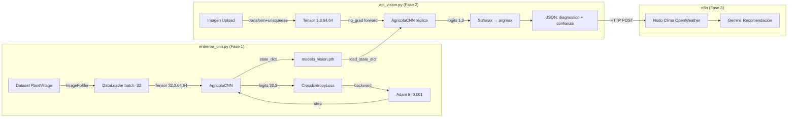

# Glosa Técnica de Hiperparámetros y Conceptos — Orquestador Agrícola Neural

> Auditoría exhaustiva de todos los hiperparámetros y conceptos de Deep Learning rastreados a lo largo de los archivos [entrenar_cnn.py](file:///home/pablocortinez/Documentos/PROYECTOS/TAREA3/src/entrenar_cnn.py) y [api_vision.py](file:///home/pablocortinez/Documentos/PROYECTOS/TAREA3/src/api_vision.py).

---

## 1. Hiperparámetros de Entrenamiento

| Parámetro | Valor | Archivo | Propósito Técnico |
|---|---|---|---|
| `IMG_SIZE` | `64` | `entrenar_cnn.py:27` | Dimensión espacial de entrada (64×64 px). Compromiso entre resolución y costo computacional. Menor que ImageNet (224) pero suficiente para patrones foliares en CPU. |
| `BATCH_SIZE` | `32` | `entrenar_cnn.py:28` | Muestras por actualización de pesos. Estándar empírico (Bengio 2012). Menor → gradientes ruidosos; mayor → más RAM, mínimos agudos. |
| `EPOCHS` | `10` | `entrenar_cnn.py:29` | Pasadas completas por el dataset. Con ~2000 imgs y batch=32 → ~630 actualizaciones totales. Conservador para evitar overfitting. |
| `lr` (learning rate) | `0.001` | `entrenar_cnn.py:108` | Tasa de aprendizaje de Adam. Valor por defecto recomendado por Kingma & Ba (2014). Controla la magnitud de cada paso de actualización. |
| `Normalize μ,σ` | `(0.5, 0.5, 0.5)` | `entrenar_cnn.py:64`, `api_vision.py:50` | Reescala tensores de [0,1] a [-1,1]. Centra distribución en 0 para gradientes más estables. Genérico (vs. medias de ImageNet). |

---

## 2. Hiperparámetros de Arquitectura (Topografía de la Red)

| Parámetro | Valor | Archivo | Propósito Técnico |
|---|---|---|---|
| `conv1 out_channels` | `16` | `entrenar_cnn.py:78` | 16 filtros iniciales para features de bajo nivel (bordes, gradientes de color). Estándar para datasets pequeños. |
| `conv2 out_channels` | `32` | `entrenar_cnn.py:83` | Duplicación progresiva (16→32). Patrón VGG: más filtros en capas profundas para features complejas (manchas, texturas de enfermedad). |
| `kernel_size` | `3×3` | `entrenar_cnn.py:78,83` | Kernel mínimo efectivo (VGGNet). Campo receptivo local con menos parámetros que 5×5 o 7×7. |
| `padding` | `1` | `entrenar_cnn.py:78,83` | "Same padding": preserva dimensiones espaciales después de convolución. `out = (64+2×1-3)/1+1 = 64`. |
| `MaxPool kernel/stride` | `2/2` | `entrenar_cnn.py:80,85` | Reduce dimensiones espaciales 50% por bloque (64→32→16). Aporta invarianza traslacional. |
| `fc1 (hidden layer)` | `8192→64` | `entrenar_cnn.py:89` | Cuello de botella: comprime 8192 features a 64 neuronas. Fuerza representación compacta. Suficiente para 3 clases sin overfitting. |
| `fc2 (output layer)` | `64→3` | `entrenar_cnn.py:91` | 3 logits de salida: uno por clase agrícola (`Oidio_Vid`, `Planta_Sana`, `Tizon_Tardio_Papa`). |
| `num_classes` | `3` | ambos archivos | Clases de clasificación: Planta Sana, Tizón Tardío (Papa), Oídio (Vid). |

---

## 3. Conceptos Clave de Deep Learning

### 3.1 Tensores

| Concepto | Ubicación | Descripción |
|---|---|---|
| **PIL → Tensor** | `transforms.ToTensor()` en ambos archivos | Convierte imagen PIL `[H,W,C]` uint8 `[0,255]` → Tensor `[C,H,W]` float32 `[0,1]`. |
| **Normalización** | `transforms.Normalize()` en ambos archivos | Aplica `z = (x-0.5)/0.5` por canal. Reescala a `[-1,1]`. |
| **unsqueeze(0)** | `api_vision.py:90` | Añade dimensión de batch: `[3,64,64]` → `[1,3,64,64]`. Requerido porque la red siempre espera `[B,C,H,W]`. |
| **view (Flatten)** | `entrenar_cnn.py:96`, `api_vision.py:38` | `x.view(x.size(0), -1)`: `[B,32,16,16]` → `[B,8192]`. Puente CNN→MLP. |

### 3.2 CNN (Red Neuronal Convolucional)

| Componente | Ubicación | Descripción |
|---|---|---|
| **Conv2d (Convolución)** | `entrenar_cnn.py:78,83` | Aplica filtros deslizantes sobre feature maps. Extrae patrones espaciales jerárquicos. |
| **ReLU (Activación)** | `entrenar_cnn.py:79,84,90` | `f(x) = max(0,x)`. Estándar desde AlexNet (2012). Derivada = 1 para x>0 → **mitiga vanishing gradient** (vs. Sigmoid cuya derivada máx es 0.25). |
| **MaxPool2d (Pooling)** | `entrenar_cnn.py:80,85` | Submuestreo: selecciona máximo en ventana 2×2. Reduce parámetros e introduce invarianza traslacional. |

### 3.3 MLP (Perceptrón Multicapa)

| Componente | Ubicación | Descripción |
|---|---|---|
| **Linear (fc1)** | `entrenar_cnn.py:89` | Capa densa 8192→64. Operación: `y = Wx + b`. 524,352 parámetros (93% del total de la red). |
| **Linear (fc2)** | `entrenar_cnn.py:91` | Capa de salida 64→3. Produce logits crudos (sin Softmax; CrossEntropyLoss la aplica internamente). |
| **Dropout** | No implementado | Regularización ausente. Área de mejora: `nn.Dropout(0.5)` entre fc1 y fc2 reduciría riesgo de overfitting. |

### 3.4 Backpropagation (Retropropagación)

| Paso | Código | Descripción |
|---|---|---|
| **Zero Grad** | `optimizer.zero_grad()` — `entrenar_cnn.py:114` | Limpia gradientes acumulados. PyTorch acumula por defecto; se debe reiniciar cada iteración. |
| **Forward Pass** | `outputs = model(inputs)` — `entrenar_cnn.py:115` | Propagación hacia adelante. Construye el grafo computacional dinámico. |
| **Loss** | `loss = criterion(outputs, labels)` — `entrenar_cnn.py:116` | Calcula escalar de error. CrossEntropyLoss: `L = -log(P(clase_correcta))`. |
| **Backward** | `loss.backward()` — `entrenar_cnn.py:117` | Recorre el grafo en orden inverso aplicando regla de la cadena. Almacena `∂L/∂w` en `.grad`. |
| **Step** | `optimizer.step()` — `entrenar_cnn.py:118` | Adam actualiza pesos: `w = w - lr·m̂/(√v̂ + ε)`. Modifica los ~529,635 parámetros in-place. |

### 3.5 Función de Pérdida

| Concepto | Ubicación | Descripción |
|---|---|---|
| **CrossEntropyLoss** | `entrenar_cnn.py:107` | Combina LogSoftmax + NLLLoss. `L = -log(P(y_true))`. Penaliza más al modelo cuando asigna baja probabilidad a la clase correcta. Ideal para clasificación multiclase. |
| **Contexto agrícola** | — | Un diagnóstico de "Planta_Sana" cuando hay Tizón produce pérdida alta → la red aprende a ser cautelosa con falsos negativos. |

### 3.6 Optimizador

| Concepto | Ubicación | Descripción |
|---|---|---|
| **Adam** | `entrenar_cnn.py:108` | Adaptive Moment Estimation (Kingma & Ba, 2014). Combina Momentum (β₁=0.9) + RMSProp (β₂=0.999). Learning rate adaptativo **por parámetro** → convergencia más rápida que SGD puro. Robusto a gradientes ruidosos. |

### 3.7 Épocas y Batches

| Concepto | Ubicación | Descripción |
|---|---|---|
| **Época (bucle externo)** | `for epoch in range(EPOCHS)` — `entrenar_cnn.py:111` | 1 pasada completa por todo el dataset (~2000 imgs). 10 épocas totales. |
| **Batch (bucle interno)** | `for i, (inputs, labels) in enumerate(dataloader)` — `entrenar_cnn.py:113` | Subconjunto de 32 muestras. ~63 batches/época. Cada batch ejecuta forward→loss→backward→step. |

### 3.8 Inferencia en Producción

| Concepto | Ubicación | Descripción |
|---|---|---|
| **model.eval()** | `api_vision.py:60` | Modo evaluación: desactiva Dropout, fija BatchNorm. Predicciones deterministas. |
| **torch.no_grad()** | `api_vision.py:93` | Desactiva autograd. ~50% menos memoria, forward más rápido. No hay backprop en producción. |
| **Softmax** | `api_vision.py:95` | `P(i) = e^(zᵢ)/Σe^(zⱼ)`. Convierte logits → probabilidades interpretables [0,1]. |
| **load_state_dict()** | `api_vision.py:59` | Carga pesos serializados en la arquitectura réplica. Requiere clase idéntica a la de entrenamiento. |

---

## 4. Parámetros Totales de la Red

| Capa | Cálculo | Parámetros |
|---|---|---|
| conv1 | `(3×16×3×3) + 16` | 448 |
| conv2 | `(16×32×3×3) + 32` | 4,640 |
| fc1 | `(8192×64) + 64` | 524,352 |
| fc2 | `(64×3) + 3` | 195 |
| **TOTAL** | — | **529,635** |

> [!IMPORTANT]
> El 99% de los parámetros están en la capa fc1 (524,352 de 529,635). Esto es típico en CNNs con clasificador FC denso. Una mejora futura sería usar Global Average Pooling antes del clasificador para eliminar fc1 y reducir parámetros drásticamente.

---

## 5. Trazabilidad Inter-Archivo

---

## 6. Áreas de Mejora Identificadas

| Área | Estado Actual | Recomendación |
|---|---|---|
| **Regularización** | Sin Dropout ni Data Augmentation | Agregar `nn.Dropout(0.5)` entre fc1 y fc2; agregar `RandomHorizontalFlip`, `RandomRotation` al pipeline de transforms. |
| **Desbalance de clases** | 152 Planta_Sana vs 1000 de las otras | Usar `WeightedRandomSampler` o `class_weight` en CrossEntropyLoss. |
| **Normalización** | Genérica (0.5, 0.5, 0.5) | Calcular media/std real del dataset PlantVillage, o usar valores de ImageNet. |
| **Validación** | Sin split train/val | Usar `random_split` para crear conjunto de validación (80/20) y monitorear overfitting. |
| **Global Avg Pool** | fc1 tiene 524K params | Reemplazar Flatten+fc1 por `nn.AdaptiveAvgPool2d(1)` + `Linear(32,3)` → ~99 params. |
